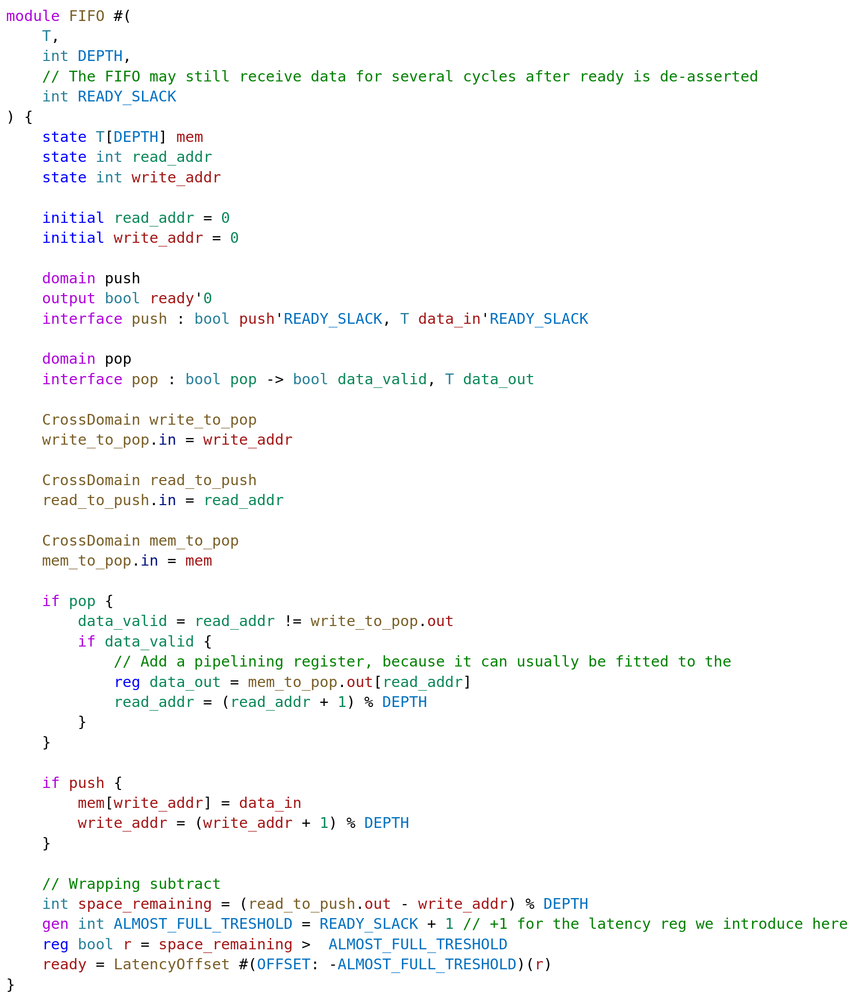
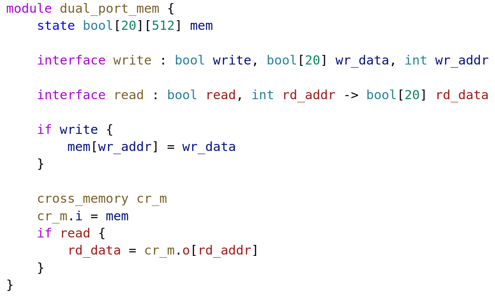
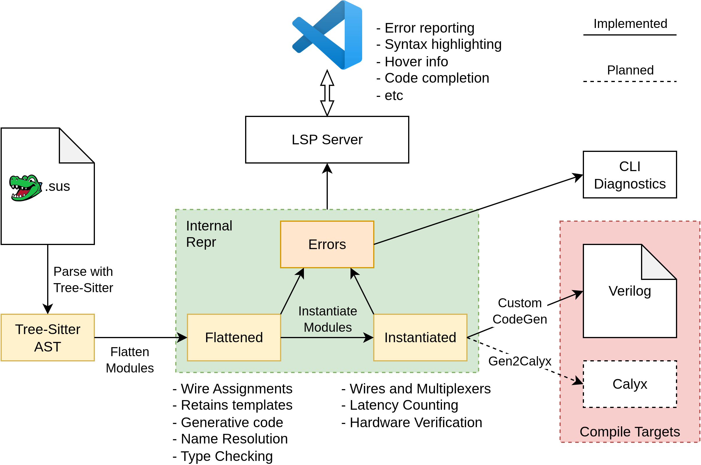

<p align="center">
    
    <br/>
    <a href="https://crates.io/crates/sus_compiler"></a>
    <a href="https://crates.io/crates/sus_compiler"></a>
    <br/>
    <a href="https://discord.gg/ZCgzjbrppz"></a>
    <a href="https://github.com/pc2/sus-compiler/actions"></a>
</p>

# SUS Language

SUS is a new RTL Hardware Design Language, similar to Verilog or VHDL, that focuses on simplifying the development of high-performance computing FPGA accelerators, without sacrificing any design freedom at the altar of abstraction. 

## Installation
Installation is done through [Rust](https://www.rust-lang.org/)'s package manager cargo ([cargo installation info](https://doc.rust-lang.org/cargo/getting-started/installation.html)). 
```bash
cargo install sus_compiler
```

To use the accompanying VSCode Extension for Syntax Highlighting and Code Suggestions ([sus-lsp](https://github.com/pc2/sus-lsp)), install [SUS Hardware Design Language](https://marketplace.visualstudio.com/items?itemName=LennartVanHirtum.sus-lsp) through the VSCode Extension Explorer, or use the F1 installation command:
```
ext install LennartVanHirtum.sus-lsp
```

## Learning SUS

To get started with learning SUS, have a look at [this talk](https://www.youtube.com/watch?v=jJvtZvcimyM). In 40 minutes it goes over most language features through examples. Because further development will make this outdated rather quickly, a changelog is provided below to keep track. 

For an example project to tinker with, see [VonTum/BitSerialMatrixMultiply](https://github.com/VonTum/BitSerialMatrixMultiply). 

#### Changelog since Talk
- Template syntax has changed to `#(NameA: 3, TypeB: type int[3], ValueC: true)`
- Standard Library is delivered with SUS Compiler
- Hindley-Milner for Concrete Typing

## Core philosophy

SUS is meant to be a direct competitor to Synthesizeable Verilog and VHDL. Its main goal is to be an intuitive and thin syntax for building netlists, such that traditional synthesis tools can still be used to analyze the resulting hardware. SUS shall impose no paradigm on the hardware designer, such as requiring specific communication protocols or iteration constructs. In other words, SUS is not there to abstract away complexity, but rather to make the inherent complexity of hardware design more manageable.

The one restriction SUS does impose over Verilog and VHDL is that it requires the hardware to be *synchronous* over one or more clocks. Asynchronous hardware is therefore *unrepresentable* making SUS less suitable for ASIC development. 

There are three main features that set SUS apart from the rest: 
- Generative Variables and Types can be freely combined. Any "Dependent Types" headaches that are caused by this are sidestepped by doing the main type checking after instantiation. 
- Easy Pipelining through an orthogonal language construct called "Latency Counting". 'Orthogonal' means that adding pipeline registers does not interfere with other language features such as generative or conditional code. 
- Separation of pipelines with interfaces. This keeps the user from accidentally crossing signals that have no logical relationship. At this level Clock Domain Crossings are implemented.

Finally, an important consideration of SUS is the user interface. SUS comes with a VSCode IDE plugin that allows the copiler to be used fully in-IDE. Compiling, typechecking and instantiation is done as the user writes code, leading to a very tight development feedback loop. 

#### What SUS gives you
- A direct 1-to-1 mapping from code to netlist
- Hardware domain separation with explicit crossing primitives
- A built-in syntax for pipelining that does not impose structural constraints
- In-IDE compilation errors & warnings
- Metaprogramming for hardware generation

##### Planned
- Type safety with Bounded Integers
- Multi-Clock modules
- Formal Verification Integration
- Syntactic sugar for common constructs like valid signals, resets and submodule communication
- Moving some[^timing] timing constraints to the source file

[^timing]: Some timing constraints affect the cycle-by-cycle functioning of the design, such as the relative speeds of synchronous clocks and False/Multi-Cycle Path constraints. Because they affect the cycle-wise behaviour of the design, they should be provided as part of the language and incorporated in simulation. Of course, timing constraints like real clock speeds, edge patterns and external component timings still rightfully belong in the Timing Constraints file. It should not be possible to express SUS code that behaves differently between Simulation and Synthesis. 

#### What SUS does not do
- Provide abstractions for handshake protocols (Like AXI)
- Runtime Iteration Constructs
- Automatic Pipelining & Retiming

Of course, while the language does not support such protocols directly in the syntax, as this would put unneccesary extra constraints on the output hardware, modules for handling them will be provided in the standard library. 

#### Example of some SUS code in the SUS VSCode Language Server. 


## Comparison to other HDLs
There's a few categories of HDLs as I see it nowadays. I shall visit them in turn:

#### The Old Guard: (System-)Verilog and VHDL:
These languages were originally designed as Hardware *Description* Languages, meant to describe exactly how hand-drawn hardware components function. Later on a "Synthesizeable Subset" was created from these languages to actually create hardware from them. The issue is, these old languages still carry this simulation-first core design. The feature-set that's actually available for synthesis is rather small, and common constructs like pipelining routinely introduce bugs. Even things like what inputs and outputs mean are left vague. 

#### High Level Synthesis: [BlueSpec](https://bluespec.com), [Intel OneAPI](https://www.intel.com/content/www/us/en/developer/tools/oneapi/toolkits.html), [Xilinx Vitis](https://www.xilinx.com/products/design-tools/vitis.html)
This approach attempts to generate hardware from an imperative description in an existing software language, usually C++. They rely on control flow analysis and a clever compiler to turn this description into hardware that actually performs the operation. The core issue with these is an over-reliance on such compiler smarts. This usually means fiddling with compiler directives until the compiler actually outputs the hardware you originally had in mind. In some cases, it may not even be possible to express the hardware you intend because the compiler designers didn't provide it. This means ptimization on such generated hardware is often impossible. The powerful synthesis tools like Intel Quartus and Vivado with their timing analyzers are unuseable. The tradeoff is inefficient use of resources and lower clock speeds.

A final thing that must be said about the corporate HLS flows, is that the promise of 'portability' is absolute bogus. These systems are simply more attempts to build walled gardens around their respective platforms. This is evident from Intel's deprecation of the more open OpenCL frontend they used to have, in favor of their platform-locked Intel OneAPI. (Which, funnily enough, is just a thin wrapper around the old OpenCL codebase). If I sound salty, it is because I am. 

#### Embedded Languages such as [Chisel](https://www.chisel-lang.org/) and [SpinalHDL](https://github.com/SpinalHDL/SpinalHDL):
If one is being pedantic, they actually shouldn't actually be called "languages" per se, but rather hardware construction libraries within an existing software language; usually Scala. There is a solid argument to be made for this style though. Why invent a new meta-language for the generation of hardware when there's widely-used software languages already out there? My main arguments against this approach are written below, but they can be summed up as the language designers having made the tradeoff of reducing development time on the compiler sacrificing the useability of the final product. 

- No hardware-specific language abstractions. Abstractions have to be built on top of the Object-Oriented or Functional basis of Scala. The regular scala constructs don't map to hardware, so instead functions have to be introduced (like `when()` for 'if') to imitate these but for hardware. 
- Providing hardware-specific tooling for such languages is difficult. One can't hover over a variable in the code and get hardware-specific information from it, because the LSP is for Scala, not for Chisel. Also the Edit-Test-Debug cycle is longer, as there is no direct in-editor feedback for incorrect hardware. 
- Finally, there is the philosophical question of: "Is the full feature set of a modern software language really necessary for hardware design?". Are Higher Order Functions, Dynamic Memory Allocation, or Object Oriented Programming necessary to generate hardware? In practice, 99% of hardware generation code is simple for loops and conditionals. Anything more complicated than that shouldn't be happening on every compile. 

#### New Hardware *Design* Languages such as [TL-Verilog](https://arxiv.org/abs/1811.01780), [Spade](https://spade-lang.org/), [Filament](https://filamenthdl.com/), [RustHDL](https://rust-hdl.org/) and now [SUS](.)
The above opinions on the other styles of hardware design are shared by my colleagues building these new hardware *design* languages. The main differences between them are philosophical: What common hardware constructs and concepts should be abstracted and how? 

One big decision all of these (including SUS) make is going all-in on Synchronous Hardware. A clock becomes a fundamental language construct instead of being a regular wire. A thing most of them also share is a Rust-inspired syntax, and being written in Rust. 

## Main Features through examples
### Pipelining through [Latency Counting](philosophy/latency.md)
```Verilog
module pow17 {
    interface pow17 : int i -> int o 
        int i2  = i * i
    reg int i4  = i2 * i2
        int i8  = i4 * i4
    reg int i16 = i8 * i8
            o   = i16 * i
}
```


### FIZZ-BUZZ Lookup Table using Generative Code
```Verilog
module fizz_buzz_gen {
    interface fizz_buzz_gen : int v -> int fb 
    gen int FIZZ = 15
    gen int BUZZ = 11
    gen int FIZZ_BUZZ = 1511
    gen int TABLE_SIZE = 256

    gen int[TABLE_SIZE] lut
    
    for int i in 0..TABLE_SIZE {
        gen bool fizz = i % 3 == 0
        gen bool buzz = i % 5 == 0
        
        gen int tbl_fb
        if fizz & buzz {
            tbl_fb = FIZZ_BUZZ
        } else if fizz {
            tbl_fb = FIZZ
        } else if buzz {
            tbl_fb = BUZZ
        } else {
            tbl_fb = i
        }

        lut[i] = tbl_fb
    }

    fb = lut[v]
}
```
In the end, the generative code is executed and all that results is a lookup table. 

### (Clock-) Domains for separating out logically distinct pipelines
For this feature to be useable you really must use the LSP. The semantic analysis of the compiler gives important visual feedback while programming that makes this much easier to understand. 

In this example, we create a memory block with a read port and a write port. This module has two domains: The read interface domain and write interface domain. Every wire in the design is part of one of these domains (or an anonymous domain if it's not connected to either interface). Signals are not allowed to cross from one domain to another unless explicitly passed through a domain crossing primitive. 



## Roadmap
### Major Milestones
- [x] Tree Sitter as parsing frontend
- [x] Arbitrary pipelined full flow
- [x] Arbitrary single-clock full flow
- [ ] Arbitrary multi-clock full flow
- [x] Generative Code
- [x] Generative Parameters
- [x] Type Templates
- [ ] Full Template Inference
- [ ] Actions, Triggers and Queries

### Language Features
- [x] Basic Tokenizer
- [x] Basic Syntax Error Reporting
- [x] Syntax error reporting with infos
- [x] Basic Token Highlighting in Terminal
- [x] Local Variable and Type Name highlighting
- [x] Array Syntax
- [x] Function Call Syntax
- [x] Unary and Binary Operators
- [x] Can Parse Multiply-Add pipeline
- [x] Can Parse Blur2 filter
- [x] If Statements
- [x] Latency Specifiers
- [x] Get rid of semicolons
- [x] Access module inputs / outputs through field names
- [ ] Array Slices
- [ ] Bound Specifiers
- [ ] Structs
- [ ] Conditional Bindings
- [x] Generative variables and assignments
- [x] Generative Conditions
- [x] Generative For Loops
- [ ] Generative While Loops
- [x] Generative Parameters
- [ ] Generative Parameter Default Arguments
- [x] Type Parameters
- [ ] Generative Asserts
- [x] Multi-Interface Syntax
- [x] Native Module integration syntax
- [x] Intrinsic Modules
- [x] Can Parse FIFO implementation
- [ ] Clock Domain Crossings
- [ ] Submodule Generators
- [x] Standard Library Bundled with compiler

### Performance, Linking and Name Resolution
- [ ] Namespaces
- [x] Single File Name Resolution
- [x] Multi File Name Resolution
- [ ] Incremental Parsing
- [ ] Incremental Compilation
- [ ] Multi-Threaded Parsing
- [ ] Multi-Threaded Compilation

### Safety
- [x] Basic Type Checking (bools, ints, arrays, etc)
- [ ] Integer and Array Bounds Checking
- [ ] Conflicting assignments (such as calling the same module twice in a single cycle, multiple assignments to a single variable)

### Typing & Inference
- [x] Hindley-Milner typing for Abstract Types
- [x] Hindley-Milner typing for Domain Types
- [x] Hindley-Milner typing for Concrete Types
- [ ] Template Type Inference
- [ ] Generative Parameter Inference
- [ ] Latency Count Inference
- [ ] Let-syntax

### Latency Counting
- [x] Basic latency assignment algorithm
- [x] Net-positive latency cycles error
- [x] Disjoint nodes error
- [x] Indeterminable port latency
- [x] Latency Counting uses latency specifiers
- [x] Latency for output-only modules
- [x] Latency Counting is invariant across arbitrary algorithm starting nodes (not quite, some starting nodes may error. But those that don't are equivalent!)
- [x] Integrate into Verilog generation
- [x] Latency cuts
- [x] Latency Offset
- [ ] Latency Cuts & Latency Counting for "disjoint Input-Output blocks"
- [ ] ~~Split Latencies~~

### LSP
- [x] Basic LSP for VSCode integration
- [x] Syntax Highlighting
- [x] Coloring of domain wires
- [x] Error and Warning Reporting
- [x] Hover type information
- [x] Hover documentation
- [x] Go to definition
- [x] File Creation/Deletion/Rename
- [x] Show last generation value
- [x] Find all references
- [x] Highlighting
- [x] Renaming
- [x] Basic code completion
- [ ] Port code completion
- [ ] Struct field code completion
- [ ] Per-Line Resource Utilization Reporting

### Code Generation
- [x] Expression Flattening
- [x] Can Generate Verilog for Multiply-Add pipeline
- [x] Can Generate Verilog for Blur2 filter
- [x] Can Generate Verilog for FIFO
- [ ] Multi-Clock Modules
- [ ] Clock Tracking for SubModules

### Fun projects to do in SUS
- [x] Bit-Serial Matrix Multiply
- [ ] Dedekind Kernel Port
- [ ] Sparse Matrix Multiply
- [ ] RISC-V CPU
- [ ] Enigma Machine
- [ ] Enigma Code Breaking
- [ ] Bitwise dedekind D10 estimation accelerator

### Safety through Interface Asserts (PDL-style asserts)
- [ ] btor2?
- [ ] Language syntax
- [ ] How powerful is it? 
- [ ] Timing Failure extraction from vendor tools

### Simulation
- [ ] Basic testbench
- [ ] "Visualization"

## Architecture


## Long Term Strategy
["The Economics of Programming Languages" by Evan Czaplicki (Strange Loop 2023)](https://www.youtube.com/watch?v=XZ3w_jec1v8)
