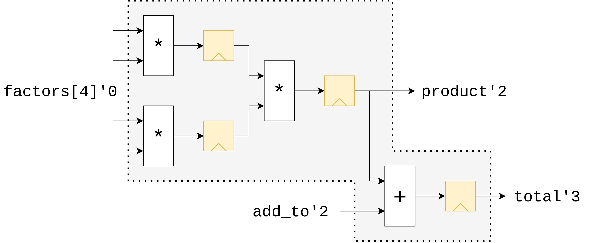
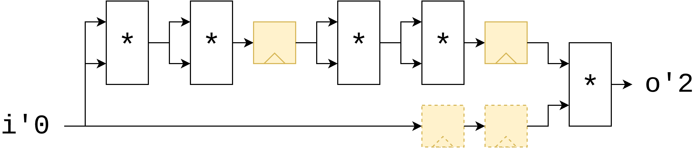
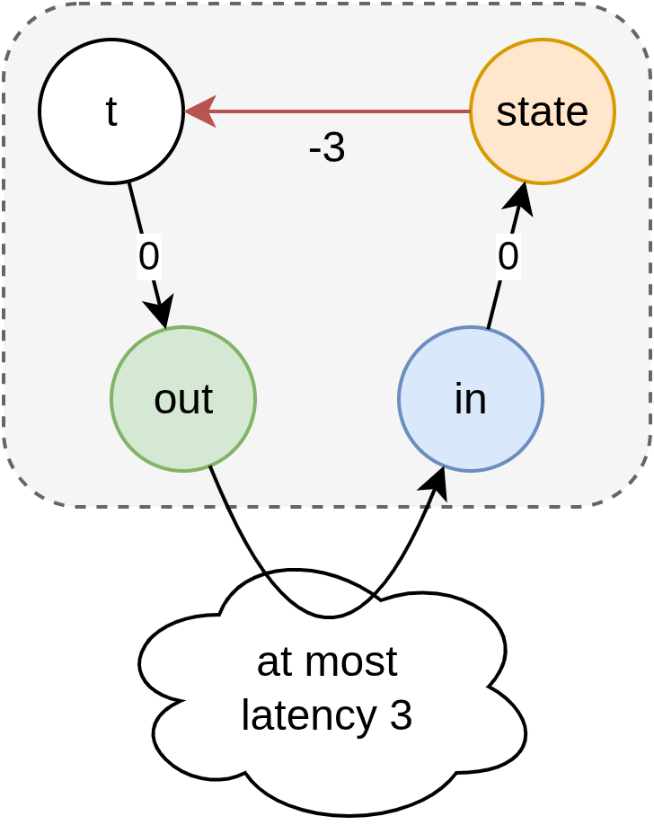
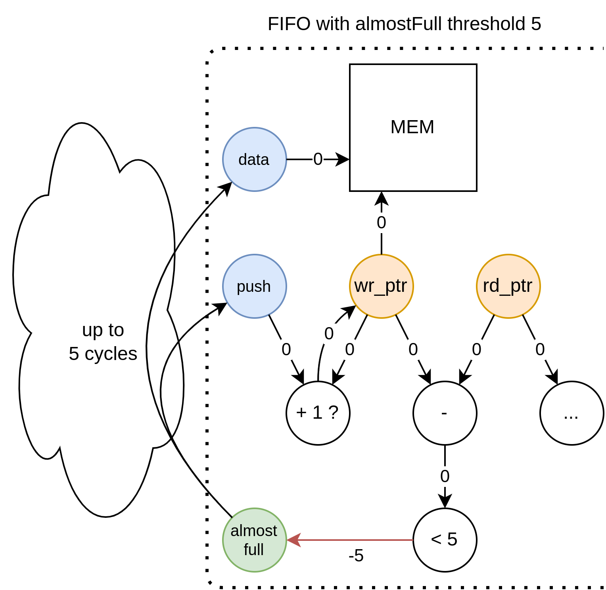
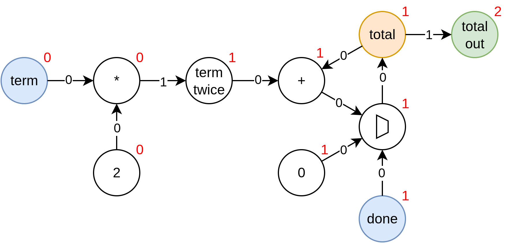
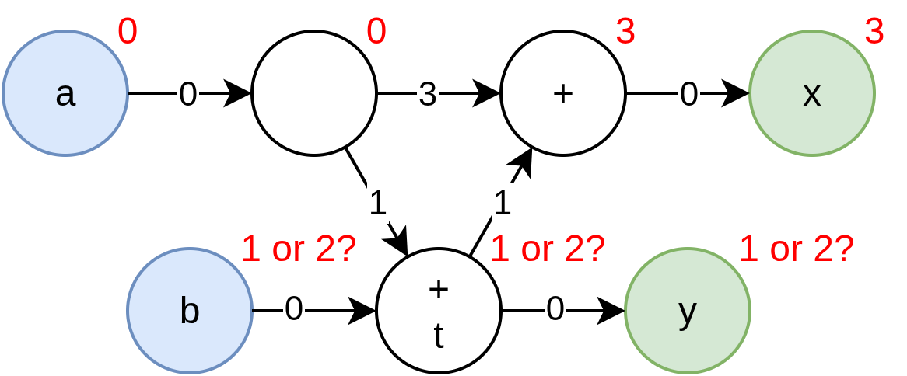

# Latency Counting
For state see [state](state.md)

A short video on how Latency Counting is used is here: ![Latency Counting in the SUS Compiler [LATTE24]](https://youtu.be/7P0BvXSHLpY)

## Theory
Inserting latency registers on every path that requires them is an incredibly tedious job. Especicially if one has many signals that have to be kept in sync for every latency register added. This is why I propose a terse pipelining notation. Simply add the `reg` keyword to any critical path and any paths running parallel to it will get latency added to compensate. This is accomplished by adding a 'latency' field to every path. Starting from an arbitrary starting point, all locals connected to it can then get an 'absolute' latency value, where locals dependent on multiple paths take the maximum latency of their source paths. From this we can then recompute the path latencies to be exact latencies, and add the necessary registers. 

### Examples
#### Inference of latencies on ports
```Verilog
module example_md {
    interface example_md :
        int[4] factors,
        int add_to ->
        int product, 
        int total

	reg int mul0 = factors[0] * factors[1]
	reg int mul1 = factors[2] * factors[3]

	reg product = mul0 * mul1
	reg total = product + add_to
}
```


#### Automatic insertion of registers
```Verilog
module pow17 {
    interface pow17 : int i -> int o 
	    int i2  = i * i
	reg int i4  = i2 * i2
	    int i8  = i4 * i4
	reg int i16 = i8 * i8
	        o   = i16 * i
}
```


#### Latency Specifiers
```Verilog
module module_taking_time {
	interface module_taking_time : int i'0 -> int o'5
	o = i
}
```


### Combinatorial loops with latency are still combinatorial loops
This is in my opinion a big benefit to making the distinction. When inserting latency registers, we are saying in effect "If we could perform these computations instantaneously, we would", and thus, a loop containing latency registers would still be a combinatorial loop. Sadly, this does break down a little when explicitly building a pipelined loop. Also combinatorial dependencies could show up across interfaces as well. Perhaps we should rethink this feature. 

### Latency counting with state
Of course, state registers are also moved around by latency. This means that while it appears like (and we want the programmer's mental model to say that) two state registers get updated at the same time, they may actually be offset from one another in time. 

However, state registers do not count towards the latency count. So specifying `reg` increases the latency count by 1, but specifying `state` does not. This makes sense, because state registers are meant to carry data across cycles, whereas latency registers are only meant for meeting timing closure, and don't allow sequential data packets to interact. 

### Maximum Latency Requirements
It's the intention of the language to hide fixed-size latency as much as possible, making it easy to create pipelined designs. 

Often however, there are limits to how long latency is allowed to be. The most common case is a `state` to itself feedback loop. If a state register must be updated every cycle, and it depends on itself, the loopback computation path may not include any latency. 

For example, a FIFO with an almost_full threshold of _N_, may have at most a `ready_out -> valid_in` latency of _N_. 

For state to state paths, this could be relaxed in several ways:
- If it is proven the register won't be read for some cycles, then the latency can be hidden in these cycles. (Requires complex validity checking)
- Slow the rate of state updating to the maximum latency, possibly allow automatic C-Slowing. 

#### Breaking out of latency counting
Feed-forward pipelines are an important and useful construct. But feed forward pipelines can't describe all hardware. We need to be able to break out of the latency counting system, and tell the latency counting system that there exists a latency differential between two nodes, without instantiating registers between them. In the case of making a dependent latency earlier than the source one, we call this edge a 'negative backedge'. This should be provided as a template module in the standard library:
```Verilog
module rebase_latency<T, gen int delta> : T i'0 -> T o'delta {/*...*/}
```

As an example, we can have a module with an internal negative backedge of -3, which itself contains some state that the backedge can originate from. The module wraps the backedge this way, and proves all of the safety requirements that come with using it. The user then is free to connect the output of this module combinatorially with the input, and with at most 3 cycles of latency. 



As a more concrete example, consider the write side of a FIFO. 


### Latency specification
Specifying latencies on every single input and output is a bit cumbersome, so we wish to infer latencies as much as possible. Sometims however specific constructions with indeterminable latencies require the user to explicitly specify the latencies. We will explore such cases in later chapters. 

When the user specifies latencies on multiple nodes, they are in effect stating that they know what the exact latencies between the given nodes are. Theorethically we should include this into the algorithm as extra edges between each pair of nodes `a` and `b`, of latency `lb-la` and `-(lb-la)` backwards. This fixes the latency differential to be as the user specifies it. In practice in the Latency Counting Algorithm, we don't actually do this in this way, but instead handle specified latencies in a dedicated part of the algorithm, to provide the user with more readable error messages. In any case, the latencies assigned by the algorithm should be equivalent to doing it with the extra edges. 

If the user provides not a single latency annotation, then we allow the compiler to set an arbitrary node's latency to 0, as a seed for the algorithm. Because input and output nodes have to be fully constrained, the compiler picks one of these if possible. 

## Requirements for the latency counting system
- Addition or Removal of any latency registers that do not violate a constraint must not affect the operation of the design.
- Feedback loops containing only latency are considered combinatorial feedback loops, and are therefore forbidden. Feedback loops must therefore have at least one state register in them. 
- When the user specifies a latency of 1 somewhere using the `reg` keyword, this instructs the compiler that the _minimum_ latency between these points is now 1. The compiler is allowed to insert additional latency registers between any two nodes as it sees fit. 
- State registers to not impact the latency counting. They count as 0 latency. 
- Any loop (which must contain at least one state register) must have a roundtrip latency ≤ 0. Negative values are permitted, and are simply attributed to the use of negative back edges. 
- Specified latencies must be matched exactly. 

### Extra requirements to allow latency inference
- The latency between input and output nodes that have a combinatorial connection must be *minimal*. In other words, if an output `o'lo` is reachable from an input `i'li` by only following forward dependencies, then `|lo|-|li|` is exactly the latency of the longest path between them. 
- Nodes that are not an input or output, don't have a latency specified, and have multiple options for their latency are set to the earliest possible latency. 

## Latency Counting Graph Algorithm
We are given a directed graph of all wires and how they combinatorially depend on each other. Each edge can have a number of latency registers placed on it. 

Example: 
```Verilog
// timeline is omitted here, not important
module Accumulator {
    interface Accumulator : int term, bool done -> int total_out 
    state int total

    int new_total = total + term

    if done {
        reg total_out = new_total
        total = 0
    } else {
        total = new_total
    }
}
```

Which results in the following graph: 


Nodes are coloured by role. Blue nodes are inputs, green nodes are outputs, orange nodes are state registers, and white nodes are combinatorial. 

On the edges are noted the minimum latency offsets in black. These are given. The goal of the algorithm is to compute a set of 'absolute latencies', which are all relative to an arbitrary node. These are given with the red nodes on the picture. Because these absolute latencies are relative to an arbitrary reference point, we accept any constant shift applied to all absolute latencies as equivalent. 

### Non Determinable inference of Input and Output absolute latencies
Sadly, while it appears reasonable to think it's possible to assign a determinable latency. Observe this contrived example:

```Verilog
module NonDeterminableLatency {
    interface NonDeterminableLatency : int a, int b -> int x, int y 
    reg int a_d = a
    int t = a_d + b
    reg reg reg int a_dd = a
    reg int t_d = t
    x = t_d + a_dd
    y = t
}
```

Simplified latency graph:


The issue starts when the inputs and outputs don't have predefined absolute latency. We are tempted to add maximization and minimization to the input and output absolute latencies, to force the module's latency span to be as compact as possible, and therefore maximize how free the user of this module is in using it. But sadly, we cannot make a uniquely determinable latency assignment for our inputs and outputs, as in this example b and y press against each other, permitting two possible implementations. 

One may think the solution would simply be to prefer inputs over outputs or something, just to get a unique latency assignment. Just move b to be the earliest of the available latencies, but even in this case, if we instead looked at the possibilities of a, and fixed b, we would again make b later by making a earlier. And since there's no way to distinguish meaningfully between inputs, there's no uniquely determinable solution either. 

To this problem I only really see three options:
- Still perform full latency computation when compiling each module separately. In the case of non-determinable latency assignment, reject the code and require the programmer to add explicit latency annotations. The benefit is better encapsulation, the programmer requires only the module itself to know what latencies are. The downside is of course less flexible modules. Though is this flexibility _really_ needed?
- ~~Infer absolute latencies on the inputs and outputs of submodules using templates which can be inferred. This would be really handy to allow latency information to flow back into the templating system, thus allowing a FIFO that alters its almostFull threshold based on its input latency. Of course, this makes absolute latency information flow from top-down instead of bottom up, so now getting the latency information back from the module would be impossible. The issue is that templates can't be instantiated partially. Either the submodule takes all of its port latencies from the calling module, or it determines its latencies itself~~
- ~~Perform latency computation at integration level, we don't define the absolute latencies on the ports of a module, unless the programmer explicitly does so. For simlpicity, this requires that every single module instantiation now compiles to its own Verilog module though, which is less than ideal for debugging~~

Simply solve the above module by explicitly specifying latencies to the two inputs:
```Verilog
module LatencySpecified {
    interface LatencySpecified : int a'0, int b'1 -> int x, int y 
    reg int a_d = a
    int t = a_d + b
    reg reg reg int a_dd = a
    reg int t_d = t
    x = t_d + a_dd
    y = t
}
```

### Latency Graph Cycles are the key
So assigning absolute latencies is difficult, and no good solution can be found in isolated cases. Perhaps another approach would work better. 

In essense, what are the reasons for which we want to count out latencies? The initial one of course was keeping signals in sync. In the vast majority of cases when you pipeline a design, you don't want to cross signals from different time steps. But of course, after pipelining a design, you need to _deal_ with the effect that this module now takes several cycles, and has a certain capacity to store in progress data. 

Maybe instead of trying to infer the latencies from the pipeline with inputs and outputs, we focussed our attention purely on the cycles. These are already nice and constrained. 

### Should Compound Types' latency be kept in sync? 
Arrays, structs, tuples, etc. Should the absolute latencies of these be kept in sync? On the one hand, it's easier on the programmer if they do stay in sync. It's easier to reason about. A problem is though, that strictly keeping all latencies of an array in sync could introduce unnecessary dependencies, and therefore make the pipeline deeper than it needed to be. Also, if we forcibly keep array and struct elements in sync, then we can't express certain generic construct, such as a latency shift register, or allowing us to pipeline a sequence of similar steps where intermediary results are all stored in the same array. 

If you go all the way to the opposite end of the spectrum however, splitting up every struct, every array, and every tuple into their component wires, then the development experience suffers. For Arrays or structs with differing latencies the compiler can't give nice diagnostics. Also from a simulation perspective, simulators know the concepts of arrays and structs. Should SUS outputs only be simulable on a wire-by-wire basis? Or should we keep the structures intact but have internally different latencies? None of these options are really appealing. 

Of course, we could mostly mitigate this by re-merging structs and arrays that happen to all have the same latency. But then again, it feels like it would be brittle and cause unexpected errors for the programmer. 

In the end, I think that having the programmer explicitly state when to split a latency is best. And we do this with the `'split` latency specifier. This explicitly splits the underlying wire into separate 'real' wires. This allows the programmer to make the tradeoff, for explicit latency flexibility, and accepting the cost that this structure will be less nice in the resulting verilog. 
