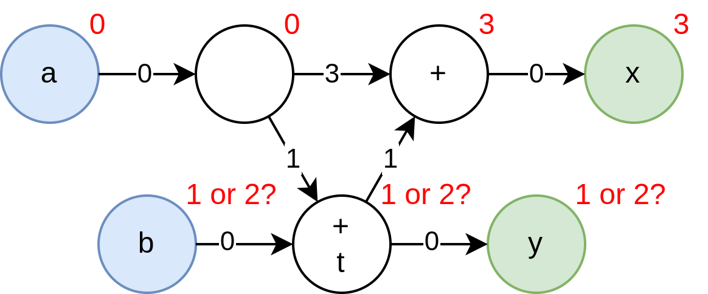

# On Latency
For state see [state](state.md)

## Latency Counting
Inserting latency registers on every path that requires them is an incredibly tedious job. Especicially if one has many signals that have to be kept in sync for every latency register added. This is why I propose a terse pipelining notation. Simply add the `reg` keyword to any critical path and any paths running parallel to it will get latency added to compensate. This is accomplished by adding a 'latency' field to every path. Starting from an arbitrary starting point, all locals connected to it can then get an 'absolute' latency value, where locals dependent on multiple paths take the maximum latency of their source paths. From this we can then recompute the path latencies to be exact latencies, and add the necessary registers. 

Example:
```
(start - 0)
A -----------+-- reg -- reg --\
(-1)        /                  +-- C (2)
B -- reg --/------------------/
```

### Combinatorial loops with latency are still combinatorial loops
This is in my opinion a big benefit to making the distinction. When inserting latency registers, we are saying in effect "If we could perform these computations instantaneously, we would", and thus, a loop containing latency registers would still be a combinatorial loop. 

### Latency counting with state
Of course, state registers are also moved around by latency. This means that while it appears like two state modules get updated at the same time, if they are independent they need not. 

However, state registers should not count towards the latency count. So specifying `reg reg` should increase the latency count by 2, but specifying `state` does not. This makes sense, because this means a feedback loop to a state register has a latency of 0, which it requires to stay within. Also, this maintains that by removing all latency registers, the total latency count becomes 0 on all ports. 

If this rule holds for all possible hardware designs is up for further research. 

### Maximum Latency Requirements
It's the intention of the language to hide fixed-size latency as much as possible, making it easy to create pipelined designs. 

Often however, there are limits to how long latency is allowed to be. The most common case is a state to itself feedback loop. If a state register must be updated every cycle, and it depends on itself, the loopback computation path may not include any latency. 

For example, a FIFO with an almost_full threshold of _N_, may have at most a `ready_out -> valid_in` latency of _N_. 

For state to state paths, this could be relaxed in several ways:
- If it is proven the register won't be read for some cycles, then the latency can be hidden in these cycles. (Requires complex validity checking)
- Slow the rate of state updating to the maximum latency, possibly allow automatic C-Slowing. 

#### Implementation using negative back-edges

We can provide a primitive construct to the user to enable them to use latencies at all, which is the _negative latency backedge_. The user simply instantiates this module betwheen two points. The negative backedge requires that it is part of a combinatorial loop. 

Usually it negative backedges would be found on the output of a module, which is combinatorially 'before' the inputs that should be returned to it (See [Combinatorial Dependency](combinatorial_dependency.md)). As an example, we can have a module with an internal negative backedge of -3, which itself contains some state that the backedge can originate from. The module wraps the backedge this way, and proves all of the safety requirements that come with using it. The user then is free to connect the output of this module combinatorially with the input, and with at most 3 cycles of latency. 


As a more concrete example, consider the write side of a FIFO. 


## Requirements for the latency counting system
- Addition or Removal of any latency registers that do not violate a constraint must not affect the operation of the design.
- Feedback loops containing only latency are considered combinatorial feedback loops, and are therefore forbidden. Feedback loops must therefore have at least one state register in them. 
- When the user specifies a latency of 1 somewhere using the `reg` keyword, this instructs the compiler that the _minimum_ latency between these points is now 1. The compiler is allowed to insert additional latency registers between any two points as it sees fit. 
- State registers to not impact the latency counting. They count as 0 latency. 
- Any loop (which must contain at least one state register) must have a roundtrip latency ≤ 0. Negative values are permitted, and are simply attributed to the use of negative back edges. 

## Latency Counting Graph Algorithm
We are given a directed graph of all wires and how they combinatorially depend on each other. Each edge can have a number of latency registers placed on it. 

Example: 
```Verilog
// timeline is omitted here, not important
module Accumulator : int term, bool done -> int total_out {
    state int total;

    reg int term_twice = term * 2;

    if done {
        reg total_out = total + term_twice;
        total = 0;
    } else {
        total = new_total;
    }
}
```

Which results in the following graph: 


Nodes are coloured by role. Blue nodes are inputs, green nodes are outputs, orange nodes are state registers, and white nodes are combinatorial. 

On the edges are noted the minimum latency offsets in black. These are given. The goal of the algorithm is to compute a set of 'absolute latencies', which are all relative to an arbitrary node. These are given with the red nodes on the picture. Because these absolute latencies are relative to an arbitrary reference point, we accept any constant shift applied to all absolute latencies as equivalent. 

### Non Deterministic inference of Input and Output absolute latencies
Sadly, while it appears reasonable to think it's possible to assign a deterministic latency. Observe this contrived example:

```Verilog
// timeline is omitted here, not important
module NonDeterministic : int a, int b -> int x, int y {
    reg int a_d = a;
    reg int t = a_d + b;
    reg reg reg int a_ddd = a;
    x = t + a_ddd;
    y = t;
}
```

Simplified latency graph:


The issue starts when the inputs and outputs don't have predefined absolute latency. We are tempted to add maximization and minimization to the input and output absolute latencies, to force the module's latency span to be as compact as possible, and therefore maximize how free the user of this module is in using it. But sadly, we cannot make a deterministic latency assignment for our inputs and outputs, as in this example b and y press against each other, permitting two possible implementations. 

One may think the solution would simply be to prefer inputs over outputs or something, just to get a deterministic latency assignment. Just move b to be the earliest of the available latencies, but even in this case, if we instead looked at the possibilities of a, and fixed b, we would again make b later by making a earlier. And since there's no way to distinguish meaningfully between inputs, there's no deterministic solution either. 

To this problem I only really see three options:
- Still perform full latency computation when compiling each module separately. In the case of non-deterministic latency assignment, reject the code and require the programmer to add explicit latency annotations. The benefit is better encapsulation, the programmer requires only the module itself to know what latencies are. The downside is of course less flexible modules. Though is this flexibility _really_ needed?
- Infer absolute latencies on the inputs and outputs of submodules using templates which can be inferred. This would be really handy to allow latency information to flow back into the templating system, thus allowing a FIFO that alters its almostFull threshold based on its input latency. Of course, this makes absolute latency information flow from top-down instead of bottom up, so now getting the latency information back from the module would be impossible. The issue is that templates can't be instantiated partially. Either the submodule takes all of its port latencies from the calling module, or it determines its latencies itself. 
- Perform latency computation at integration level, we don't define the absolute latencies on the ports of a module, unless the programmer explicitly does so. For simlpicity, this requires that every single module instantiation now compiles to its own Verilog module though, which is less than ideal for debugging. 

### Latency Graph Cycles are the key
So assigning absolute latencies is difficult, and no good solution can be found in isolated cases. Perhaps another approach would work better. 

In essense, what are the reasons for which we want to count out latencies? The initial one of course was keeping signals in sync. In the vast majority of cases when you pipeline a design, you don't want to cross signals from different time steps. But of course, after pipelining a design, you need to _deal_ with the effect that this module now takes several cycles, and has a certain capacity to store in progress data. 

Maybe instead of trying to infer the latencies from the pipeline with inputs and outputs, we focussed our attention purely on the cycles. These are already nice and constrained. 
